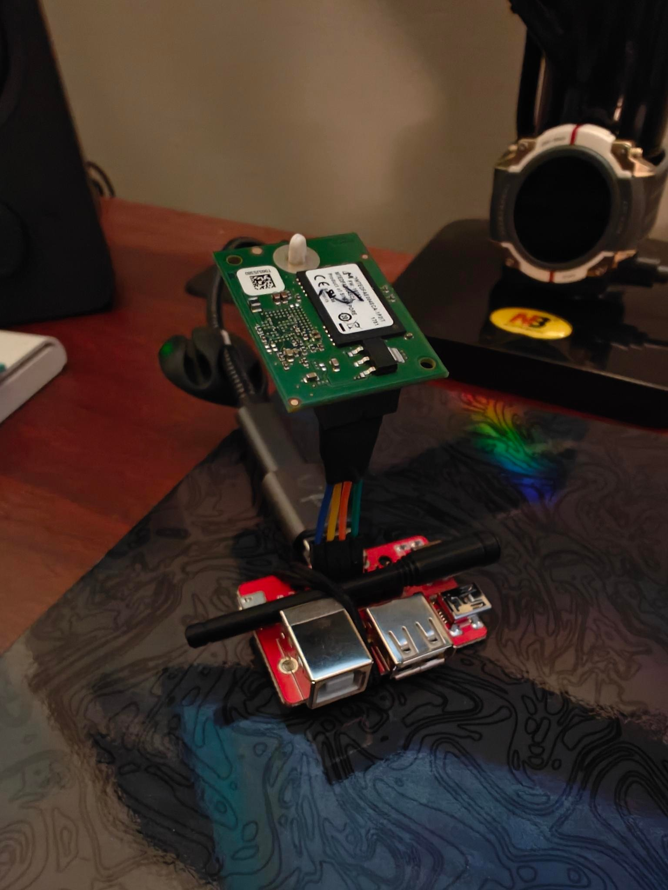
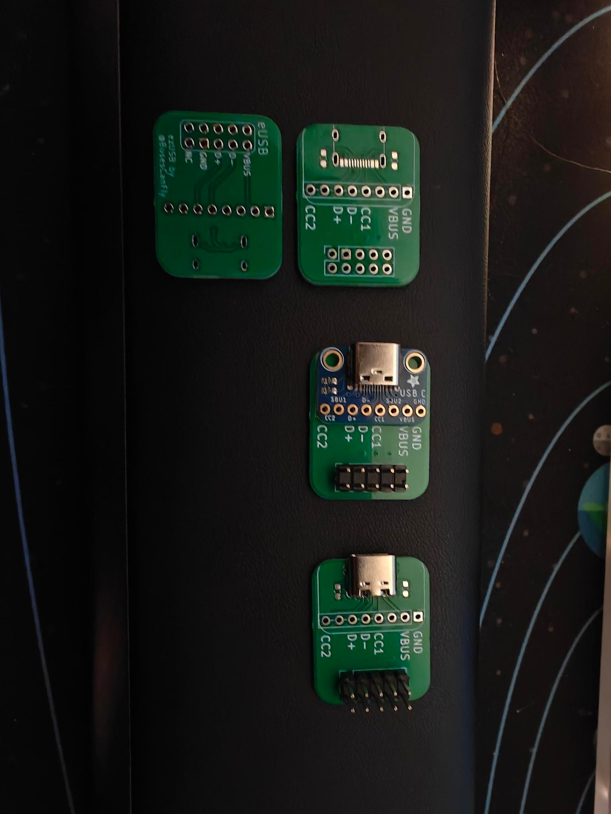

# ezUSB
Simple eUSB adapter

## What is this?
A very simple USB adapter for eUSB modules (the industrial version of a USB thumb drive)

There are several adapters online but they're either [no longer sold](https://www.amazon.com/U-Reach-eUSB-converter-2-0mm-5-PACK/dp/B016PD8TIA), [expensive](https://www.cmizapper.com/products/eusb.html), or [bulky](https://www.aliexpress.us/item/3256803756389704.html). 

You can very easily cut a USB cable, wire up a multipurpose USB breakout, but I wanted a simple, easy eUSB adapter - so, now we have ezUSB! :)

## Modes

ezUSB was designed to be as easy as possible - you can solder in a USB-C receptacle and the optional CC line resistors, leaving the header row avaliable as a USB breakout! Alternatively, simply solder on an [Adafruit USB-C breakout](https://www.adafruit.com/product/4090).

#### s/o Team Dumpsterfire <3